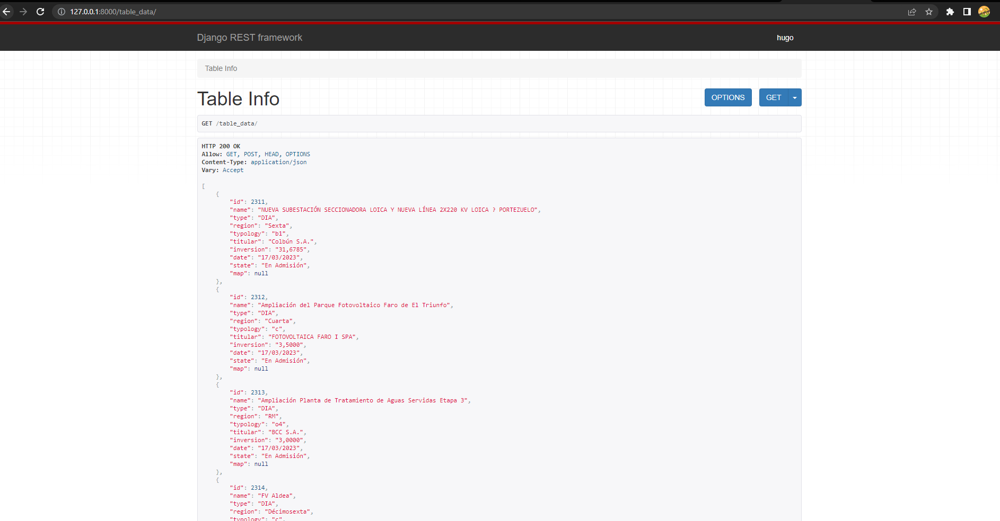
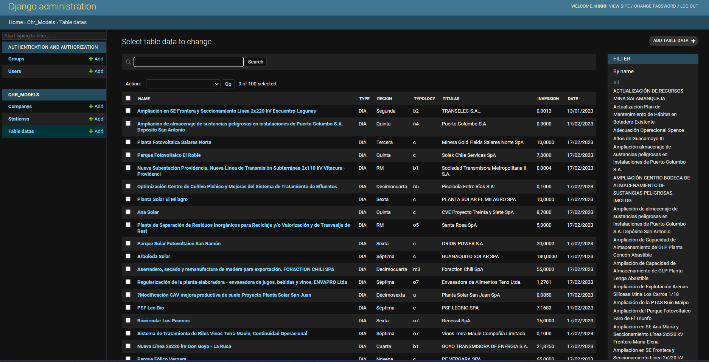

# chr_test

### Notas.

- el archivo Main contiene el programa principal el cual inicia la obtencion de los datos y enviar estos a los modelos
- comenzar en el archivo main y correr script , seguir las instrucciones en consola y seleccionar alguna de las opciones del menu
- Se una una instancia de AWS-RDS que contiene la base de Datos PostgresSQL
- todas las tareas se pueden ejecutar desde el archivo main.py
- iniciar la opcion 3 del menu en ultimo lugar es una gran cantidad de informacion

### Descripcion.

El siguiente proyecto es la realizacion de dos tareas presentadas
en el documento enviado por correo electronico 

### Tarea 1

### Desarrollo
- Por medio de la libreria request obtuve toda la data de la API , luego de analizar la estructura json de la api con 
postman fui creando distintas listas, las que luego transforme en un dataframe de pandas con la estructura definida para 
los nuevos modelos de Django.Por medio de sqlAlchemy se crea la conexion con la base de datos y se envian los datos a la
db, use este metodo por que simples queries son demasiado lentas, en cambio usando un dataframe en segundos se envian los datos
- analizando la informacion defini dos modelos uno llamado company y otro llamado stations, los que representan la compañia madre
y cada una de las estaciones donde se encuentran objetos de la API , y cada estacion tiene una relacion con la compañia madre
- por medio del dataframe creado envie la informacion de la API a la base de datos, , usar los modelos de Django , tambien es demasiado lento 
- Cree una vista personalizada en el admin de Django para visualizar la informacion obtenida de la API, como si fuera una 
base de datos con columnas y filas, ademas de un filtro y una barra de busqueda
ver imagen Adjunta al final del documento
- genere una vista de la informacion de la base de datos usando restframework con la nueva estructura que defini en los modelos 
ver imagen Adjunta al final del documento

### Tarea 2

### Desarrollo
- usando selenium , puede automatizar el ingreso a la pagina, luego de analizar el dropdown , logre que cada X periodo de tiempo 
el dropdown fuese tomando un nuevo valor y asi avance pagina tras pagina
- el script por cada cambio de pagina recoje la informacion de la tabla principal,, la cual identifique por medio de su clase y cada una de sus filas
- el script genera un archivo json con la informacion obtenida, este archivo queda almacenado en la carpeta 
json_files
- se genera una vista en el admin de Django para visualizar la informacion obtenida de la tabla de la pagina
- se genera una Api por medio de restframework para entregar la data con una nueva estructura

Creacion de una nueva vista en admin para visualizar la informacion obtenida de la API

Creacion de una Api por medio de restframework para entregar la data con una nueva estructura

Creacion de una Api por medio de restframework para entregar la data con una nueva estructura.

Creacion de una nueva vista en admin para visualizar la informacion obtenida de la tabla de la pagina

